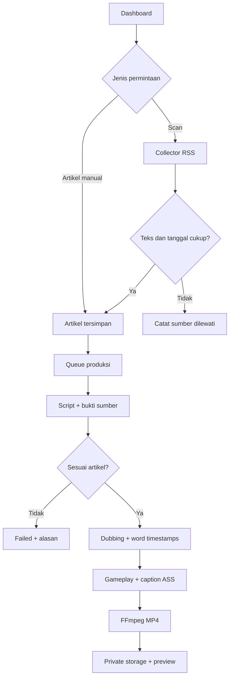

# Alur automation v0.1

## Data

- `factory_members`: allowlist user produksi. Hanya backend/SQL admin yang menambahkan.
- `sources`: feed milik user, enable/disable dan error terakhir.
- `articles`: teks, URL, timestamp publikasi, fingerprint judul, skor.
- `assets`: path gameplay private dan konfirmasi penggunaan.
- `jobs`: antrean, stage, error, result, waktu mulai/selesai. Frontend hanya insert/select.
- `renders`: MP4, script lengkap, evidence dan sumber. Hanya worker menulis.

## Pemilihan berita

MVP memakai skor heuristik kebaruan (maksimal 60) + panjang teks (maksimal 30). Bukan prediksi viral, bukan view count, bukan skor confidence kebenaran. Deduplikasi memakai fingerprint judul dan similarity string >0.86 pada 500 judul terakhir. Bisa melewatkan judul berbeda tentang peristiwa yang sama; semantic clustering dan coverage score ditunda.

## Penyusunan script

AI diminta menyusun 5–8 kalimat 75–120 kata, batas validator 4–10 kalimat 50–150 kata. Kutipan evidence tiap kalimat harus ditemukan persis pada body. Pemeriksaan AI kedua mengecek dukungan isi artikel. Ini tidak membuktikan sumber benar dan tidak mengonfirmasi dua portal independen; user perlu review editorial hasil sebelum publikasi.

Subtitle memakai Whisper word timestamps dari dubbing sungguhan, dibagi empat kata per tampilan. Kemiripan transkrip-script <0.88 menggagalkan job. Angka yang ditulis berbeda bisa menyebabkan false rejection; jangan menghapus pemeriksaan tanpa menguji alignment. Audio dirender utuh (15–90 detik); target editorial 30–60 detik, belum dipaksakan dengan time-stretch.

## Operasi dan batas

- Worker memproses satu job sekali jalan; CLI `--once` untuk satu job, mode default polling terus.
- Browser ditutup tidak menghentikan queue. Worker harus tetap menyala.
- Batas waktu API 180 detik; FFmpeg 900 detik; ukuran feed 5 MB.
- Tidak menyalin foto portal secara otomatis; visual memakai asset library user.
- Tidak ada endpoint menerima API secret di browser. Service role dan OpenAI key hanya environment worker.
- Pipeline berhenti pada MP4 siap review. Tidak ada klaim auto-publish TikTok telah tersedia.
- Error dipertahankan pada jobs, retry membuat job baru. Upsert output MP4 menggunakan path job deterministik; render metadata unique per job.

## Tahap berikut setelah setup live

1. UAT Supabase RLS, storage, login, biaya dan kualitas suara.
2. Uji dan pasang feed masing-masing publisher; adapter full article hanya jika akses memungkinkan.
3. Semantic clustering, cross-source attribution dan update/correction handling.
4. Scheduler UI dengan budget atomik, pause/cancel, heartbeat/recovery dan retention.
5. Integrasi TikTok setelah memeriksa akses, audit dan persyaratan API untuk penggunaan aplikasi ini.
